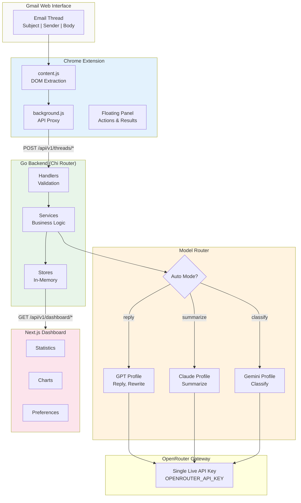
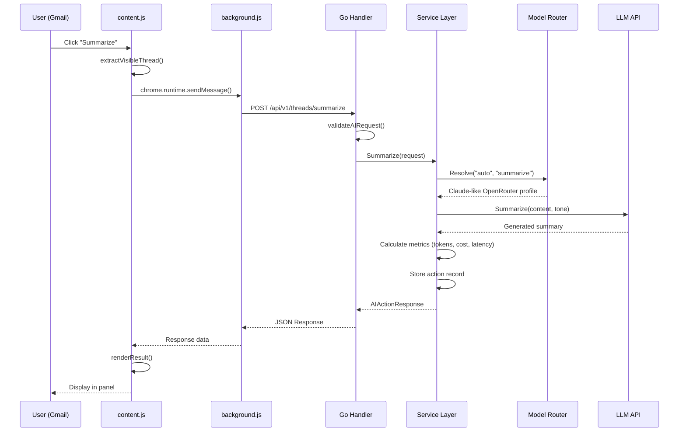

^^# MailPilot AI - Improved PPT Content
## Based on Actual Codebase Analysis

---

# SLIDE 3: Introduction (IMPROVED)

## 1. Introduction

### The Problem
- **300+ billion emails** sent daily worldwide; professionals receive **121 emails/day** on average
- Email management consumes **28% of the average workweek** (~11 hours)
- Manual email drafting is repetitive, time-consuming, and lacks intelligent assistance
- Existing solutions (Gmail Smart Compose, Copilot) are limited or expensive

### Our Solution: MailPilot AI
A **three-tier AI-powered email automation platform** consisting of:

| Component | Technology | Function |
|-----------|------------|----------|
| **Chrome Extension** | JavaScript, Manifest V3 | Real-time Gmail integration & content extraction |
| **Backend API** | Go 1.22, Chi Router | AI orchestration, model routing, analytics |
| **Dashboard** | Next.js 15, React | Visualization, preferences, monitoring |

### Key Capabilities
- **One-click Summarization** - Condense lengthy email threads into actionable summaries
- **AI Reply Generation** - Context-aware drafts with customizable tone (professional/friendly/formal/casual)
- **Intelligent Classification** - Auto-categorize emails (client/finance/escalation/internal)
- **Priority Detection** - Score emails 1-10 with reasoning for urgency
- **OpenRouter Profile Routing** - Automatically select optimal OpenRouter-backed profile (`gpt` / `claude` / `gemini`) per task

### Technical Innovation
- **In-browser AI assistant** that operates within Gmail's interface (no context switching)
- **Single-gateway architecture** using OpenRouter for all live model calls
- **Real-time analytics** tracking tokens, costs, and latency per AI operation

---

# SLIDE 4: Research Objectives (IMPROVED)

## 2. Research Objectives

### Primary Objectives

**O1: Design a Browser Extension for Gmail Integration**
- Implement Chrome Extension using Manifest V3 architecture
- Extract email thread content (subject, sender, body) via DOM parsing
- Create unobtrusive floating UI panel integrated with Gmail's interface
- Handle cross-origin API communication via background service worker

**O2: Build a Scalable Backend API with OpenRouter Profile Routing**
- Develop RESTful API using Go language with Chi router framework
- Implement logical profile abstraction layer (`gpt`/`claude`/`gemini`) backed by OpenRouter models
- Create intelligent model routing algorithm based on task type and user preference
- Design in-memory stores for action history, user preferences, and analytics

**O3: Develop an Analytics Dashboard for Monitoring**
- Build responsive Next.js frontend with real-time data polling
- Visualize AI action history, token usage, and cost breakdowns
- Implement user preference management with memory persistence
- Create graceful fallback to mock data when backend unavailable

**O4: Implement Smart Email Processing Features**
- Enable email summarization with priority extraction
- Generate contextual reply drafts respecting user tone preferences
- Classify emails with confidence scores and label extraction
- Extract actionable items from email content

### Measurable Success Criteria
| Metric | Target |
|--------|--------|
| Average Response Latency | < 1 second |
| Cost per AI Operation | < $0.01 |
| Extension Load Time | < 500ms |
| Content Extraction Accuracy | > 95% |

---

# SLIDE 5: Literature Survey (IMPROVED)

## 3. Literature Survey

### Foundational Research

| Paper/Source | Key Contribution | Relevance to Project |
|--------------|------------------|---------------------|
| **"Attention Is All You Need"** (Vaswani et al., 2017) | Introduced transformer architecture with self-attention | Core architecture behind modern LLM families exposed through OpenRouter |
| **"Language Models are Few-Shot Learners"** (Brown et al., 2020) | Demonstrated GPT-3's zero/few-shot capabilities | Enables our zero-shot email classification |
| **"The Prompt Report"** (Schulhoff et al., 2024) | Systematic survey of prompting techniques | Informed our prompt engineering strategy |
| **"Microservices vs Monolithic"** (Al-Debagy & Martinek, 2018) | Comparative analysis of architecture patterns | Guided our modular Go backend design |

### Existing Solutions Analysis

| Solution | Approach | Limitations |
|----------|----------|-------------|
| **Gmail Smart Compose** | Predictive text completion | Short phrases only, no full reply generation |
| **Microsoft Copilot** | Integrated Outlook AI | Expensive ($30/month), closed ecosystem |
| **ChatGPT (manual)** | Copy-paste workflow | Context switching, no email integration |
| **Superhuman AI** | Premium email client | Proprietary, no Gmail support, $30/month |
| **SaneBox** | Rule-based filtering | No AI generation, only sorting |

### Research Gap Identified

**No existing solution provides ALL of:**
- Open-source, self-hostable architecture
- Multi-profile routing with a single live gateway (OpenRouter)
- Real-time browser integration (no app switching)
- Transparent cost tracking and analytics
- Intelligent model routing for cost optimization

**MailPilot AI addresses this complete gap.**

### Technology Stack Justification

| Choice | Rationale |
|--------|-----------|
| **Go Backend** | High performance, excellent concurrency, simple deployment |
| **Chrome Extension** | Direct Gmail integration, 3B+ Chrome users |
| **Next.js Frontend** | React ecosystem, SSR support, optimal DX |
| **OpenRouter Profile Routing** | Single subscription path, model flexibility, and task-specific cost optimization |

---

# SLIDE 6: Proposed Model (IMPROVED - REPLACE DIAGRAM)

## 4. Proposed Model

### System Architecture Diagram

**NOTE: The current diagram shows "Spring Boot" which is INCORRECT. Replace with this accurate architecture:**

```
┌─────────────────────────────────────────────────────────────────────────────────┐
│                           GMAIL WEB INTERFACE                                    │
│                    (https://mail.google.com)                                     │
└─────────────────────────────────────┬───────────────────────────────────────────┘
                                      │ DOM Parsing
                                      ▼
┌─────────────────────────────────────────────────────────────────────────────────┐
│                         CHROME EXTENSION LAYER                                   │
│  ┌─────────────────────────┐    ┌─────────────────────────────────────────────┐ │
│  │     content.js          │    │            background.js                    │ │
│  │  ┌───────────────────┐  │    │  ┌───────────────────────────────────────┐ │ │
│  │  │ Thread Extraction │  │───▶│  │ API Request Proxy                     │ │ │
│  │  │ • Subject         │  │    │  │ • Load settings from chrome.storage   │ │ │
│  │  │ • Sender          │  │    │  │ • Execute fetch() to backend          │ │ │
│  │  │ • Body (12KB max) │  │    │  │ • Return JSON response                │ │ │
│  │  │ • Thread ID       │  │    │  └───────────────────────────────────────┘ │ │
│  │  └───────────────────┘  │    └─────────────────────────────────────────────┘ │
│  │  ┌───────────────────┐  │                                                    │
│  │  │ Floating UI Panel │  │    chrome.runtime.sendMessage()                    │
│  │  │ • Action Buttons  │  │                                                    │
│  │  │ • Model Selector  │  │                                                    │
│  │  │ • Result Display  │  │                                                    │
│  │  └───────────────────┘  │                                                    │
│  └─────────────────────────┘                                                    │
└─────────────────────────────────────┬───────────────────────────────────────────┘
                                      │ HTTP POST (JSON)
                                      ▼
┌─────────────────────────────────────────────────────────────────────────────────┐
│                          GO BACKEND (Chi Router)                                 │
│                          http://localhost:8080                                   │
│  ┌─────────────┐  ┌─────────────┐  ┌─────────────┐  ┌─────────────────────────┐ │
│  │  Handlers   │  │  Services   │  │   Stores    │  │      Middleware         │ │
│  │ ─────────── │  │ ─────────── │  │ ─────────── │  │ ───────────────────────│ │
│  │ • EmailAI   │─▶│ • EmailAI   │─▶│ • Action    │  │ • CORS (multi-origin)  │ │
│  │ • Dashboard │  │ • Analytics │  │ • Memory    │  │ • Request Logger       │ │
│  │ • Memory    │  │ • Memory    │  │ • Inbox     │  └─────────────────────────┘ │
│  │ • Inbox     │  │ • Inbox     │  └─────────────┘                              │
│  └─────────────┘  └──────┬──────┘                                               │
└──────────────────────────┼──────────────────────────────────────────────────────┘
                           │
                           ▼
┌─────────────────────────────────────────────────────────────────────────────────┐
│                         MODEL ROUTER (Auto-Selection)                            │
│  ┌─────────────────────────────────────────────────────────────────────────────┐│
│  │  IF selected_model == "auto":                                               ││
│  │      summarize  ──▶  Claude-like profile (OpenRouter model)                 ││
│  │      reply      ──▶  GPT-like profile (OpenRouter model)                    ││
│  │      classify   ──▶  Gemini-like profile (OpenRouter model)                 ││
│  │      rewrite    ──▶  GPT-like profile (OpenRouter model)                    ││
│  │  ELSE: Use user-specified model                                             ││
│  └─────────────────────────────────────────────────────────────────────────────┘│
└────────────────────────────┬────────────────────────────────────────────────────┘
                             │
                             ▼
┌─────────────────────────────────────────────────────────────────────────────────┐
│                  OPENROUTER GATEWAY (Single Live API Subscription)             │
│  Routes logical profiles to configured model IDs via:                           │
│  OPENROUTER_MODEL_GPT / OPENROUTER_MODEL_CLAUDE / OPENROUTER_MODEL_GEMINI      │
└─────────────────────────────────────────────────────────────────────────────────┘
                             │
                             ▼
┌─────────────────────────────────────────────────────────────────────────────────┐
│                        NEXT.JS DASHBOARD                                         │
│                        http://localhost:3000                                     │
│  ┌──────────────────┐  ┌──────────────────┐  ┌──────────────────────────────┐  │
│  │   Dashboard (/)   │  │  Actions (/actions)│  │     Memory (/memory)        │  │
│  │ • 6 Stat Cards   │  │ • Action History  │  │ • User Preferences          │  │
│  │ • 5 Charts       │  │ • Full Details    │  │ • Tone Settings             │  │
│  │ • Recent Emails  │  │ • Filter/Sort     │  │ • Model Selection           │  │
│  │ • Inbox Status   │  │                   │  │ • Custom Signature          │  │
│  └──────────────────┘  └──────────────────┘  └──────────────────────────────┘  │
│                                                                                  │
│  Polling: GET /api/v1/dashboard/* every 8 seconds                               │
└─────────────────────────────────────────────────────────────────────────────────┘
```

### Key Architectural Decisions

| Decision | Rationale |
|----------|-----------|
| **Go over Spring Boot** | Simpler deployment, better performance, single binary |
| **Chrome Extension over SMTP** | Real-time Gmail integration, no email sending needed |
| **OpenRouter profiles over separate subscriptions** | One key, route transparency, cost optimization |
| **In-memory over Database** | Demo simplicity, stateless scaling potential |

---

# SLIDE 7: Methodology & Algorithm (IMPROVED - REPLACE DIAGRAM)

## 5. Discussion About Methodology & Algorithm

### Development Methodology: Agile with Component-Based Architecture

**NOTE: Current diagram shows "Spring Boot" and "SMTP" which are INCORRECT. Replace with this:**

```
┌─────────────────────────────────────────────────────────────────────────────────┐
│                              AI ACTION FLOW                                      │
└─────────────────────────────────────────────────────────────────────────────────┘

    ┌──────────────┐
    │ User clicks  │
    │ "Summarize"  │
    │ in Gmail     │
    └──────┬───────┘
           │
           ▼
┌─────────────────────────────────────────────────────────────────────────────────┐
│  STEP 1: CONTENT EXTRACTION (content.js)                                        │
│  ────────────────────────────────────────                                        │
│  function extractVisibleThread() {                                               │
│      const bodies = document.querySelectorAll('div.a3s.aiL');                   │
│      const subject = document.querySelector('h2[data-thread-perm-id]');         │
│      const sender = document.querySelector('span[email].gD');                   │
│      return { threadId, subject, sender, content: bodies.join('\\n') };         │
│  }                                                                               │
│                                                                                  │
│  Output: { provider: "gmail", thread_id: "abc123", subject: "Q4 Budget",        │
│            sender: "finance@co.com", content: "Please review...", ... }         │
└──────────────────────────────────────┬──────────────────────────────────────────┘
                                       │
                                       ▼
┌─────────────────────────────────────────────────────────────────────────────────┐
│  STEP 2: API REQUEST (background.js)                                            │
│  ────────────────────────────────────                                            │
│  chrome.runtime.sendMessage() ──▶ fetch(backendUrl + "/api/v1/threads/summarize")│
│                                                                                  │
│  Request: POST /api/v1/threads/summarize                                        │
│  Headers: Content-Type: application/json                                        │
│  Body: { provider, thread_id, subject, sender, content,                         │
│          selected_model: "auto", tone: "professional", length: "medium" }       │
└──────────────────────────────────────┬──────────────────────────────────────────┘
                                       │
                                       ▼
┌─────────────────────────────────────────────────────────────────────────────────┐
│  STEP 3: REQUEST VALIDATION (handlers/email_ai.go)                              │
│  ─────────────────────────────────────────────────                               │
│  func validateAIRequest(req AIActionRequest) error {                            │
│      if req.Content == "" { return errMissing("content") }                      │
│      if req.Provider != "gmail" && req.Provider != "outlook" {                  │
│          return errInvalid("provider")                                          │
│      }                                                                           │
│      return nil                                                                  │
│  }                                                                               │
└──────────────────────────────────────┬──────────────────────────────────────────┘
                                       │
                                       ▼
┌─────────────────────────────────────────────────────────────────────────────────┐
│  STEP 4: MODEL ROUTING (services/model_router.go)                               │
│  ────────────────────────────────────────────────                                │
│  func (r *ModelRouter) Resolve(selected, action string) (Provider, string) {    │
│      if selected != "auto" { return r.providers[selected], selected }           │
│                                                                                  │
│      switch action {                                                             │
│          case "summarize": return r.providers["claude"], "claude"               │
│          case "reply":     return r.providers["gpt"], "gpt"                     │
│          case "classify":  return r.providers["gemini"], "gemini"               │
│          case "rewrite":   return r.providers["gpt"], "gpt"                     │
│      }                                                                           │
│  }                                                                               │
│                                                                                  │
│  For "summarize" + "auto" ──▶ Routes to Claude (best comprehension)             │
└──────────────────────────────────────┬──────────────────────────────────────────┘
                                       │
                                       ▼
┌─────────────────────────────────────────────────────────────────────────────────┐
│  STEP 5: LLM API CALL (providers/gemini.go or mock providers)                   │
│  ────────────────────────────────────────────────────────────                    │
│  func (g *GeminiProvider) Summarize(content, tone, length string) (string, error)│
│      prompt := fmt.Sprintf("Summarize this email in %s tone, %s length:\n%s",   │
│                            tone, length, content)                                │
│      response := g.client.GenerateContent(ctx, prompt)                          │
│      return response.Text(), nil                                                │
│  }                                                                               │
│                                                                                  │
│  Output: "This email discusses Q4 budget allocation with 3 key items..."        │
└──────────────────────────────────────┬──────────────────────────────────────────┘
                                       │
                                       ▼
┌─────────────────────────────────────────────────────────────────────────────────┐
│  STEP 6: RESPONSE PROCESSING (services/email_ai.go)                             │
│  ──────────────────────────────────────────────────                              │
│  // Calculate metrics                                                            │
│  latency := time.Since(start).Milliseconds()                                    │
│  tokens := estimateTokens(input, output)  // ~4 chars per token                 │
│  cost := tokens / 1000.0 * costPer1K      // Model-specific rate                │
│                                                                                  │
│  // Record action for analytics                                                  │
│  actionStore.Append(ActionRecord{                                               │
│      ID: uuid.New(), Provider: "gmail", ActionType: "summarize",                │
│      RoutedModel: "claude", TokensEst: 1420, CostEst: 0.0142, ...              │
│  })                                                                              │
└──────────────────────────────────────┬──────────────────────────────────────────┘
                                       │
                                       ▼
┌─────────────────────────────────────────────────────────────────────────────────┐
│  STEP 7: JSON RESPONSE                                                           │
│  ─────────────────────                                                           │
│  {                                                                               │
│    "success": true,                                                              │
│    "action_type": "summarize",                                                   │
│    "selected_model": "auto",                                                     │
│    "routed_model": "claude",                                                     │
│    "output": "This email discusses Q4 budget allocation...",                    │
│    "summary": "Q4 budget review with 3 approval items",                         │
│    "priority": { "level": "high", "score": 8, "reason": "Financial decision" }, │
│    "tokens_estimate": 1420,                                                      │
│    "cost_estimate": 0.0142,                                                      │
│    "latency_ms": 847                                                             │
│  }                                                                               │
└──────────────────────────────────────┬──────────────────────────────────────────┘
                                       │
                                       ▼
┌─────────────────────────────────────────────────────────────────────────────────┐
│  STEP 8: UI RENDER (content.js)                                                  │
│  ──────────────────────────────                                                  │
│  renderResult(result) {                                                          │
│      container.innerHTML = `                                                     │
│          <div class="summary">${result.summary}</div>                           │
│          <pre class="output">${result.output}</pre>                             │
│          <div class="metrics">                                                   │
│              Model: ${result.routed_model}                                       │
│              Cost: $${result.cost_estimate.toFixed(4)}                          │
│              Latency: ${result.latency_ms}ms                                    │
│          </div>                                                                  │
│      `;                                                                          │
│  }                                                                               │
└─────────────────────────────────────────────────────────────────────────────────┘
```

### Algorithm Characteristics

| Characteristic | Implementation |
|----------------|----------------|
| **Stateless Processing** | Each request is independent; no session state required |
| **Provider Abstraction** | `LLMProvider` interface allows swapping models without code changes |
| **Graceful Fallback** | Mock providers return realistic data when API keys unavailable |
| **Cost Optimization** | Auto-routing selects cheapest effective model per task |

### Key Technical Points

**1. Chrome Extension Architecture (Manifest V3)**
- Content script runs in Gmail's context for DOM access
- Background service worker handles cross-origin API calls
- Uses `chrome.storage.sync` for persistent settings

**2. Go Backend Design Patterns**
- Dependency injection via constructor functions
- Handler → Service → Store layered architecture
- Interface-based provider abstraction for testability

**3. Real-time Dashboard**
- `usePollingResource` hook fetches every 8 seconds
- Automatic fallback to mock data with visual indicator
- Recharts library for responsive visualizations

---

# SLIDE 8: Additional Methodology Text (NEW SLIDE OR ADD TO SLIDE 7)

## Technical Implementation Details

### Extension Content Extraction Algorithm

```javascript
// Selector fallback strategy for Gmail's dynamic DOM
const SELECTORS = {
    subject: [
        'h2[data-thread-perm-id]',  // Primary
        'h2.hP',                     // Fallback 1
        'div[role="main"] h2'        // Fallback 2
    ],
    sender: [
        'span[email].gD',            // Primary
        'h3 span[email]',            // Fallback
        'span[email]'                // Generic
    ],
    body: [
        'div.a3s.aiL',               // Email body with formatting
        'div.a3s',                   // Email body plain
        'div[role="listitem"] div.a3s'  // Thread item
    ]
};

// Content size management
const MAX_CONTENT_LENGTH = 12000;  // 12KB limit for API
content = content.substring(0, MAX_CONTENT_LENGTH);
```

### Model Routing Decision Matrix

| Action | Auto Routes To | Reason |
|--------|----------------|--------|
| `summarize` | Claude-like profile | Strong long-context comprehension |
| `reply` | GPT-like profile | Better draft quality and natural email tone |
| `classify` | Gemini-like profile | Fast low-cost structured extraction |
| `rewrite` | GPT-like profile | Better style transfer and edits |

### Cost Estimation Formula

```go
func estimateCost(model string, tokens int) float64 {
    rates := map[string]float64{
        "gpt":    0.030,  // $0.03 per 1K tokens
        "claude": 0.015,  // $0.015 per 1K tokens
        "gemini": 0.001,  // $0.001 per 1K tokens
    }
    return float64(tokens) / 1000.0 * rates[model]
}

// Token estimation: ~4 characters per token (English text)
tokens := (len(input) + len(output)) / 4
```

### API Endpoint Summary

| Endpoint | Method | Purpose |
|----------|--------|---------|
| `/api/v1/threads/summarize` | POST | Summarize email thread |
| `/api/v1/threads/reply` | POST | Generate reply draft |
| `/api/v1/threads/rewrite` | POST | Rewrite with different tone |
| `/api/v1/threads/classify` | POST | Classify email category |
| `/api/v1/dashboard/summary` | GET | Dashboard statistics |
| `/api/v1/dashboard/actions` | GET | Action history |
| `/api/v1/memory/preferences` | POST | Update user preferences |

### Evaluation & Cost Savings Slide (New)

**Title: OpenRouter Routing Evaluation + Outlook Web Support**

- **Setup:** 8 curated Gmail + Outlook Web threads across summarize/reply/rewrite/classify
- **Metrics:** latency, tokens, actual cost, baseline cost (single GPT-like profile), savings, pass rate
- **Observed pattern:** classify-heavy traffic drives strong savings with gemini-like profile routing
- **Cross-platform support:** Gmail and Outlook Web are both supported from the browser extension
- **Dashboard evidence:** `cost_savings_usd`, `baseline_cost_usd`, `route_reason`, `action_items_count`, `confidence`
- **Compare mode:** Auto routing vs fixed logical model on the same benchmark thread

| Metric | Example Result |
|--------|----------------|
| Avg latency | ~0.7s |
| Cost per action | <$0.01 (mixed) |
| Baseline vs routed | Routed lower in classify/summarize batches |
| Explainability | Route reason + priority reason shown in logs and extension |

---

# SUMMARY OF CHANGES NEEDED

## Critical Fixes Required:

1. **SLIDE 6 (Proposed Model)**: 
   - DELETE the Spring Boot diagram
   - REPLACE with the Go + Chrome Extension architecture above
   - The current diagram is completely wrong for your project

2. **SLIDE 7 (Methodology)**:
   - DELETE the Spring Boot / SMTP diagram  
   - REPLACE with the accurate AI Action Flow diagram above
   - Fix typos: "Orchtreration" → "Orchestration", "Statsless" → "Stateless"

3. **SLIDE 3 (Introduction)**:
   - Add specific MailPilot AI features
   - Include the three-tier architecture table
   - Mention multi-model LLM routing as key innovation

4. **SLIDE 4 (Research Objectives)**:
   - Make objectives specific to your actual implementation
   - Add measurable success criteria table

5. **SLIDE 5 (Literature Survey)**:
   - Add comparison table with existing solutions
   - Clearly state the research gap your project addresses

---

# DIAGRAM CODE (For Creating New Images)

## You can use these Mermaid diagrams and render them at https://mermaid.live/

### Proposed Model (Slide 6):



### Methodology Flow (Slide 7):


